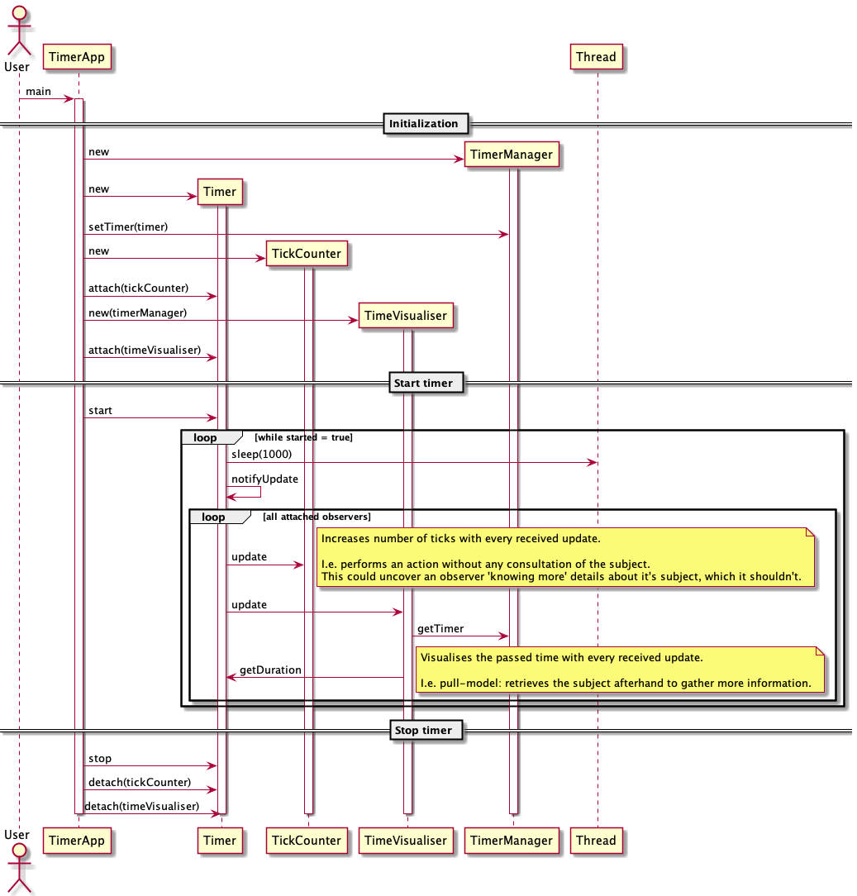

# Observer or Publish-Subscribe

> One-to-many dependency between objects (subject and observers). When the subject's state changes, all interested observers are notified.

> publish-subscribe  
> 
> The subject publishes notifications. Sending them without having to know who the observers are (no tight coupling).  
> Any number of observers can subscribe to receive notifications.

## When to use
- when one abstraction depends upon the other. Encapsulating them in separate objects allow to vary and reuse them independently.  
E.g. many subjects responsible for notifying (different) changes, can notify different observers of all kind. As they are interchangeable.
- when change in one object requires changing others, and you don't know how many objects need to be changed
- when the object who notifies change does not need to know or make assumptions about who the receivers are (no tight coupling)

## Who

Subject (interface): 
- provides interface for attaching, detaching Observers
- knows its observers. Any number of Observers may observe a subject

Observer (interface):
- provides update interface to allow for notification of changes by a subject

ConcreteSubject (implementation of Subject):
- stores attached ConcretObservers
- sends notification to attached observers when it's state changes

ConcreteObserver (implementation of Observer):
- maintains a reference to a ConcreteSubject
- stores state that should stay consistent with the subject's  
E.g. subject (data) changes, the observer (view) should be consistently updated.
- implements the Observer's update interface to keep it's state consistent 

## Things to think about

- **pass** a **subject** to the observer when observing more than one subject, so it knows which subject to examine.
- **watch** out for **dangling references** to deleted subjects.  
In case when a subject is passed to the observer and referenced. Notify the observer by extending the Observer with a delete notification.  
- make sure the **Subject state is self-consistent** before notification.
In other words, make sure the Subject state change is performed before notifying about it. Causing the Observer to query and receive an incorrect state.  
This is especially important when overriding methods. Calling e.g. it's super method which already notifies before a state change is fully completed!
- **avoid Observer-specific update protocols**
  - push model: subject sends observer detailed information about the change
    - makes observer less reusable, because the Subject has to make assumptions about the Observer classes (what do they need to know?)
  - pull model: subject sends nothing, observer asks for details explicitly thereafter
    - may be inefficient as the Observer must ascertain what changed without help from the Subject
- **specify modifications of interest**  (as a solution to the above update protocols)  
  - extend the subject's registration interface to allow registering observers for specific events (interests)  
  - extend the oberver's interface to be updated supplied with subject and interest (specifying what the update is for)
- **encapsulate complex update semantics** When the dependency relationship between subjects and observers is complex, an intermediate object (Change Manager) to maintain this relationship might be required. E.g. an operation involves multiple changes to several subjects. It might be interesting to notify observers after all subjects have been modified.
To avoid notifying observrs more than once. A ChangeManager has 3 responsibilities:
    - map subject's to it's observers by providing an interface
    - define particular update strategy
    - update all dependent observers at request of a subject

## Simple Observer Example

